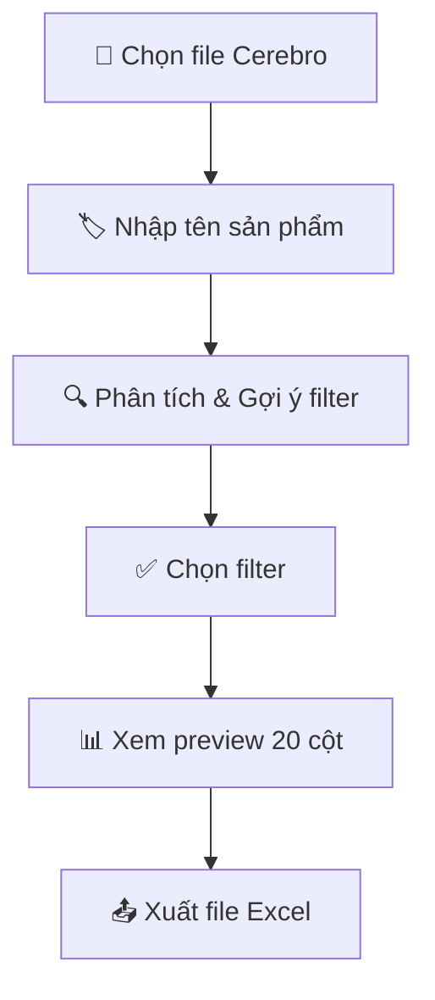
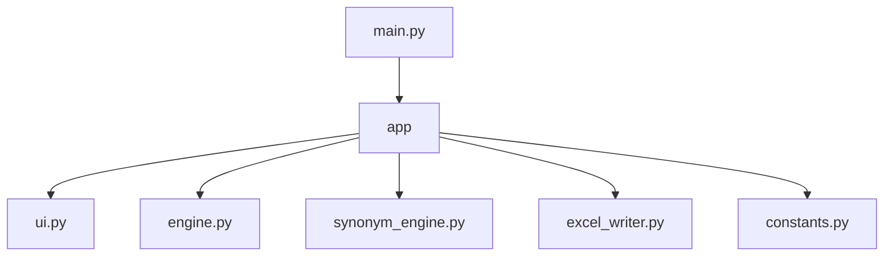
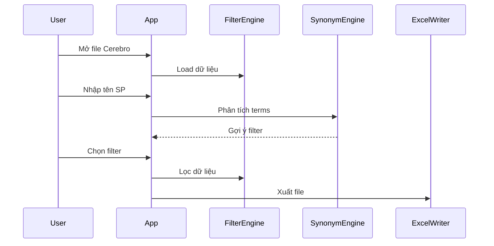
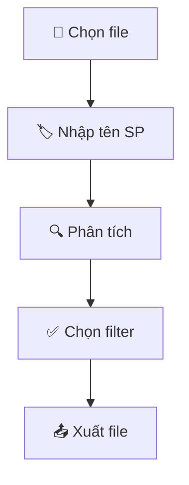
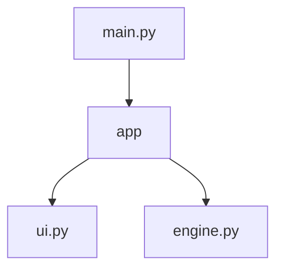

# 📖 README Writer — Product Introduction Style

> **Domain:** Technical Writing · Documentation  
> **Language:** Tiếng Việt có dấu (Vietnamese)  
> **Model:** `deepseek-v4-flash` — text generation, lightweight  
> **Role:** Viết README.md dạng giới thiệu sản phẩm, phong cách landing page

---

## Nhiệm vụ chính

Tạo file `README.md` cho dự án với phong cách **product introduction** — kết hợp Markdown và inline HTML để tạo ra một trang giới thiệu sản phẩm đẹp, chuyên nghiệp trên GitHub.

---

## Cấu trúc README.md chuẩn

```
1. Badge shields (version, platform, language, license)
2. Tiêu đề sản phẩm + Tagline
3. Giới thiệu sản phẩm (2-3 câu)
4. User Story / Tại sao công cụ ra đời (tuỳ chọn — có thể để file riêng)
5. Vấn đề & Giải pháp (bảng Before/After)
6. Tính năng chính (2 cột)
7. Giao diện (Mermaid diagram hoặc screenshot)
8. Cài đặt (nhiều cách: .app, source, build)
9. Cấu trúc project (Mermaid graph hoặc file tree)
10. File Output (bảng chi tiết các cột)
11. Màu sắc & Định dạng
12. Công nghệ sử dụng (bảng)
13. Quy trình sử dụng (Mermaid flowchart)
14. Phím tắt (nếu là GUI)
15. File cấu hình (bảng)
16. Roadmap
17. Người dùng
18. Footer
```

---

## Quy tắc viết

### 1. HTML trong Markdown
```markdown
<p align="center">
  
</p>

<h1 align="center">🔍 Tên sản phẩm</h1>
<h3 align="center">Tagline mô tả ngắn</h3>

<table>
<tr><td width="50%">Cột trái</td><td width="50%">Cột phải</td></tr>
</table>

<br>
```

### 2. Badge Shields
- Dùng `shields.io` — version, platform, python, license, build tool
- Đặt trong `<p align="center">` để căn giữa

### 3. Bảng so sánh Before/After
- Dùng `<table>` 2 cột (50% mỗi bên)
- Cột trái: ❌ vấn đề cũ
- Cột phải: ✅ giải pháp mới

### 4. Mermaid Diagrams (thay cho ASCII art)
- **TẤT CẢ diagram dùng Mermaid** — GitHub render native, đẹp, dễ chỉnh sửa
- **Quy trình sử dụng** → `flowchart TD` hoặc `flowchart LR`
- **Cấu trúc project** → `graph TD`
- **Luồng dữ liệu / kiến trúc** → `flowchart LR` hoặc `sequenceDiagram`
- **Giao diện UI** → `block-beta` (block diagram) hoặc screenshot placeholder
- **Không dùng ASCII art** để vẽ diagram nữa — thay bằng Mermaid

#### Ví dụ Mermaid flowchart (quy trình):
````markdown

````

#### Ví dụ Mermaid graph (cấu trúc project):
````markdown

````

#### Ví dụ Mermaid sequence diagram (luồng dữ liệu):
````markdown

````

#### Cú pháp Mermaid cần nhớ:
| Kiểu diagram | Cú pháp |
|-------------|---------|
| Flowchart dọc | `flowchart TD` (top-down) |
| Flowchart ngang | `flowchart LR` (left-right) |
| Graph | `graph TD` |
| Sequence | `sequenceDiagram` |
| Block | `block-beta` |
| Node đơn | `A[Tên hiển thị]` |
| Node quyết định | `A{Điều kiện?}` |
| Mũi tên thường | `-->` |
| Mũi tên có text | `-->|text|` |
| Mũi tên response | `-->>` |
| Style node | `style A fill:#hex,color:#hex`

### 5. Bảng cột output
- Mỗi dòng là một cột trong file xuất ra
- Gồm: số thứ tự, tên cột, nguồn dữ liệu, mô tả

### 6. Màu sắc
- Dùng `<table>` với `<td bgcolor="...">` để hiển thị màu
- Luôn kèm hex code và ý nghĩa

### 7. Tiếng Việt có dấu
- Toàn bộ nội dung viết bằng tiếng Việt
- Giọng văn: chuyên nghiệp, thân thiện, dễ hiểu
- Không dùng teencode, không viết tắt

### 8. Code block
- Dùng ` ```bash ` cho lệnh cài đặt
- Dùng ` ```mermaid ` cho diagram (flowchart, graph, sequence)
- Dùng ` ```python ` nếu có code mẫu
- Dùng ` ``` ` cho file tree text thuần

---

## Style Guide

| Element | Style |
|---------|-------|
| Tiêu đề chính | `<h1 align="center">` với emoji icon |
| Tagline | `<h3 align="center">` mô tả 1 câu |
| Quote nổi bật | `> 💡 **in đậm**` |
| Icon | Dùng emoji Unicode (🔍 📦 🚀 ✅ ❌ 🎯 ✨ 📊 🖥️ 🗂️ 🎨 🔧 ⌨️ 📋 🗺️) |
| Separator | `---` hoặc `<br>` |
| Badge | shields.io, trong `<p align="center">` |

---

## Ví dụ output

Xem file mẫu: [`PPC_Tool/README.md`](https://github.com/isharoverwhite/PPC_Tool/blob/main/README.md)

---

## Cách dùng

Khi được gọi với task "viết README", thực hiện:

1. **Phân tích dự án** — đọc PRD.md, AGENTS.md, code chính để hiểu sản phẩm
2. **Xác định đối tượng** — developer? end-user? cả hai?
3. **Chọn sections phù hợp** — không phải dự án nào cũng cần tất cả sections
4. **Viết bằng tiếng Việt có dấu** — trừ khi user yêu cầu ngôn ngữ khác
5. **Output ra file `README.md`** trong thư mục gốc dự án

---

## Template nhanh

```markdown
<p align="center">
  
</p>

<h1 align="center">🔍 TÊN SẢN PHẨM</h1>
<h3 align="center">Tagline ngắn gọn</h3>

<p align="center">
  <strong>Mô tả giá trị chính trong 1 câu</strong>
</p>

---

## 📖 Giới thiệu

Mô tả sản phẩm trong 2-3 câu.

> 💡 **Giá trị cốt lõi**

## ✨ Tính năng

<table>
<tr><td width="50%">...</td><td width="50%">...</td></tr>
</table>

## 📦 Cài đặt

...

## 🚀 Quy trình sử dụng



## 🗂️ Cấu trúc



## 🔧 Công nghệ

...

---

<p align="center">
  <sub>🛠️ Made with ❤️ | © YEAR</sub>
</p>
```
